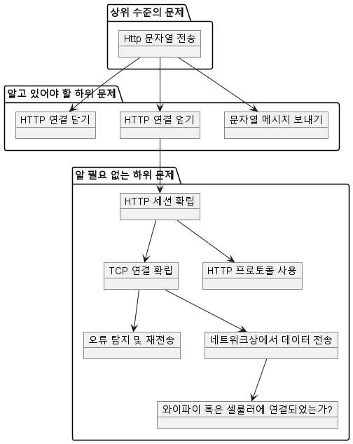

# 1. 코드 품질
### 코드 품질이 중요한 이유
|   | 고품질 코드 | 저품질 코드 |
|---|---|---|
| 최초 요구 사항 | 완전하게 충족 | 경계 조건을 처리하지 못하기 때문에 완전하게 충족하지 못함 |
| 요구 사항 변화 | 사소한 추가 작업 필요 | 대규모의 코드 변경 및 리팩터링 필요 |
| 오류 발생 시 | 시스템이 복구되거나 부분적으로 작동 | 시스템은 미리 정의되지 않은 상태에 놓이고 데이터는 손상될 가능성이 있음 |
| 처음 접하는 상황 | 명백히 예상되지 않은 상황도 처리 | 시스템은 미리 정의되지 않은 상태에 놓이고 데이터는 손상될 가능성이 있음 |
| 시스템 공격 | 시스템은 안전한 상태이고 손상되지 않음 | 시스템은 미리 정의되지 않은 상태에 놓이고 손상될 가능성이 있음 |
| 결론 | 신뢰할 수 있고, 유지보수가 쉬우며 버그가 거의 없는 소프트웨어 | 신뢰할 수 없고 유지보수가 어려우며 버그가 많은 소프트웨어 | 

* 소프트웨어 개발 및 배포 프로세스


### 고품질의 코드가 이루고자 하는 네 가지 목표
1. 작동해야 하고
2. 작동이 멈추지 않고
3. 변화하는 요구 사항에 적응할 수 있고
   4. 요구 사항을 모두 만족해서 시장에 늦게 나가거나
   5. 일단 만들어서 시장에 나갔으나 초기 피드백 대응후 시장에 늦게 나가거나
4. 중복 기능을 만들 필요가 없다.
   5. 이미 잘 만들어져 있다면

### 고품질 코드 작성을 위한 높은 수준에서의 여섯 가지 전략
1. 코드는 읽기 쉬워야 한다.
   2. 무슨 일을 무엇을 가지고 어떻게 하면 뭐가 나오는지
2. 코드는 예측 가능해야 한다.
   3. 이름과 그에 대응하는 동작만 하자
3. 코드를 오용하기 어렵게 만들라.
   4. 인자 명확하고 필요한것만
4. 코드를 모듈화하라.
   5. 외부에 의존하지 않고 실행할 수 있도록
5. 코드를 재사용 가능하고 일반화할 수 있게 작성하라.
   6. 드릴은 벽도 뚫고 바닥도 뚫고(재사용)
   7. 드릴은 뚫기도 하고 나사를 박기도 하고(일반화)
6. 테스트가 용이한 코드를 작성하고, 제대로 테스트하라.
### 고품질 코드 작성은 일정을 지연시키는가?
* 초반에는 느릴 수 있으나 중장기적으로 보면 결국 더 빠른 경우가 많다.

# 2. 추상화 계층
### 깔끔한 추상화 계층을 통해 문제를 하위 문제로 세분화하는 방법
```java
HttpConnection connection = HttpConnection.connect("http://example.com/server");
connection.send("Hello server");
connection.close();
```
추상화 계층 위에서 보면 매우 간단한 코드이지만 내부에서는
1. 문자열 serialize
2. Http 프로토콜의 동작
3. TCP 연결
4. 네트워크 확인
5. 데이터 -> radio frequency로 변경
6. 데이터 전송 오류 및 수정

상위 수준의 문제는 단순히 "메시지를 보낸다" 하지만 실제로는 이러한 많은 동작들이 필요함.

상위 수준에서는 Http 프로토콜이 어떻게 구현되는지 알 필요 없게 분리되어 있다.



### 추상화 계층이 코드 품질의 요소를 달성하는 데 어떻게 도움이 되는지
* 가독성
  * 코드의 모든 세부 사항을 이해하긴 어렵지만 한번에 다뤄야 하는 층을 한두개로 제한함으로써 가독성을 올린다.
* 모듈화
  * 하위 문제에 대한 해결책을 명확하게 분할하여 구현 세부 사항이 외부로 노출되지 않도록 보장
* 재사용성 및 일반화성
  * 추상화 계층을 통해 하위 문제에 대한 해결책을 재사용 하기 용이함.
  * 문제가 적절하게 추상화 되면 해결책이 여러 상황에서 일반화될 수 있다.    
* 테스트 용이성
  * 추상화 계층은 테스트해야할 범위를 줄여주고 동작을 명확하게 한다.
### API 및 구현 세부 사항
* 코드 호출 시 볼 수 있는 것
  * public class, interface, method
  * name, arguments, return type
* 볼 수 없는 것
  * 구현 세부 사항
* API에서 공개할 것 외에는 모두 구현 세부 사항이다.
* 코드를 하나의 API라고 생각하면 추상화 계층을 나누는데 도움이 된다.
### 함수, 클래스 및 인터페이스를 사용해 코드를 추상화 계층으로 나누는 방법
* 함수
  * SRP 지키기
  * 함수의 이름을 명확하게
  * 문장으로 바꿔보자
* CLASS
  * line count < 300
  * cohesion이 높은 class
    * sequence
    * functional
  * separation of cohesion
    * tv와 게임기의 예
      * tv는 input을 display 해주는 interface
      * 게임기는 게임의 변화를 ouput
      * 사용자는 게임기의 output을 tv에 input으로 넣어 화면을 볼 수 있다.
      * tv를 더 크게 바꾸더라도 게임기에는 아무 변화가 없음.
* interface
  * 계층 사이를 뚜렷이 구분하는 방법 중 하나.
  * interface의 구현체가 하나뿐이어도 구현하는 경우
    * public api를 명확하게 보여줌
    * 알고보면 하나 더 필요할 수 있음
    * 테스트가 쉬워짐(mocking이 쉬워짐)
    * 하나의 클래스로 두개의 하위 문제 해결해 코드의 일반화 가능성을 높임
      * LinkedList는 List와 queue를 모두 구현한다.
    * 그러나 더 많은 작업과 코드의 복잡성이 증가할 수 있음.
* layer가 너무 얇을때의 문제
  * boiler plate로 인해 코드양 증가
  * 더 많은 depth
  
* 이 사실들은 모든 개발자가 알고 있지만 적용하지 못하는 경우가 많다.

# 3. 다른 개발자와 코드 계약
* 예측 가능한 코드와 오용하기 어렵게 만들기는 모두 다른 개발자와의 상호작용에서 유용하게 동작한다.
### 다른 개발자들이 코드와 어떻게 상호작용 하는지
* 자신에게 명백하다고 다른 사람에게도 명백하진 않다.
* 다른 개발자가 무의식중에 코드를 망가뜨릴 수 있다.
* 시간이 지나 본인의 코드도 기억하지 못한다. 
* 다른(또는 미래의 자신)은 새로운 코드를 볼때
  * 함수 클래스 enum의 이름을 보고
  * 리턴타입, 매개변수를 보고
  * 문서 또는 주석을 읽고
  * 직접 문의하거나
  * 구현체를 읽어본다.
### 코드 계약과 코드 계약의 세부 조항
* 선결 조건 : input
* 사후 조건 : output
* 불변 사항 : ??
* 계약의 명확한 부분
  * 함수/ 클래스 이름
  * 인자
  * 반환
* 세부 사항
  * 주석과 문서
### 세부 조항을 최소화하는 것이 어떻게 오용과 예측을 벗어나는 코드를 예방하는 데 도움이 되는가
* 개발자가 세부 사항을 모두 알아야 한다면 (예를들어 호출 순서) 오용할 가능성이 크다. 제대로 동작하지 않는다.
* 잘못된 일은 처음부터 불가능하게 만든다.
### 세부 조항을 피할 수 없다면 체크와 어서션을 어떻게 사용할 수 있는가
* 컴파일 타임에 제약할 수 없다면 runtime에 에러를 발생시킨다.
  * 체크
    * if(null), if(true)등의 조건 사용
    * 컴파일 타임에 체크하는 것 보다는 약한 제약
    * 테스트나 개발 단계에서 발견할 수 있음.
      * 그러나 테스트 어려운 조건이거나
      * 예외 발생이 catch 되어 인식할 수 없을수도 있음.
    * 체크가 많다면 세부 사항에 대한 고려를 다시 해봐야할 수 있음.
  * 어서션
    * 체크와 거의 동일하지만 컴파일되지 않음
    * 사용되는 경우
      * 성능
      * 심각한 수준의 문제가 아닌 경우 넘어가기 위해(?)