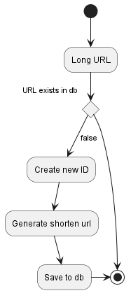

# 8장 URL 단축기 설계
### 1단계 - 요구사항
* 기능 요구사항
  * url을 짧게 줄인다
  * 요청이 들어오면 원래 url로 redirection
  * 고가용성, 확장성, fault tolerance
* 쓰기 : 일 1억개 생성, 1160/s
* 읽기 : 쓰기 * 10
* 10년 기준 3650억개의 레코드 보관
* url 평균길이 100 가정시 36.5TB의 저장소 필요

### 2단계 - 개략적 설계
* API ENDPOINT, 기본적으로 2개 필요
  * 생성
    * POST /api/v1/data/shorten
  * 사용
    * GET /api/v1/shortUrl
* URL redirection
  * http status 301,302 사용하여 redirection
  * 301은 단말에서 caching
    * 서버 부하 줄어드나 변경사항 서버로 호출 안됨
  * 302는 단말 caching 없음
    * 클릭율등을 정확하게 집계
* 기본 설계는 hash table
  * serialize -> encryption -> hashing 하는 방법도 있음
  * db 필요 없음
### 3단계 - 상세 설계
* 해시 함수의 크기 결정
  * 3650억개의 충돌을 막아야 하므로 62^7 길이 필요
* hash collision
  * CRC32도 7보다 길다
  * 앞의 7자리만 사용
    * 충돌 시 원본 url에 의미없는 string 부여하고 다시 hashing
    * db를 다녀와야 하므로 성능 떨어짐
* base-62 변환
  * 62진법 사용
  * url이 길어질 수 있음
  * 보안상 문제 url 추측 가능
* flow

### 4단계 - 마무리
* CALL이 증가할 경우 처리율 제한 장치 통해 걸러낼 수 있다
* 웹 계층은 무상태 계층으로 쉽게 증설 축소 가능
* 데이터 베이스의 규모 확장 가능
* 데이터 분석 솔루션 통해 shorten url에 얼마나 접근했는지 확인
* 고가용성 일관성 안정성은 대규모 시스템에서 반드시 갖추어야 할 속성들이다