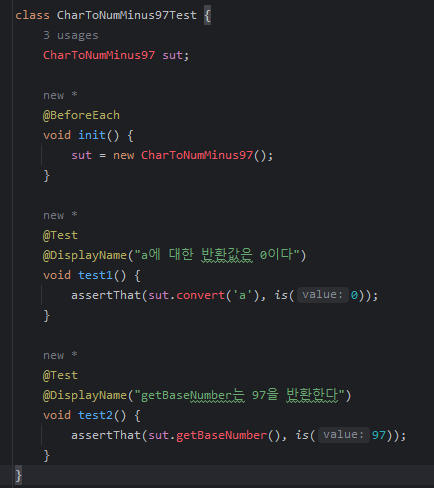
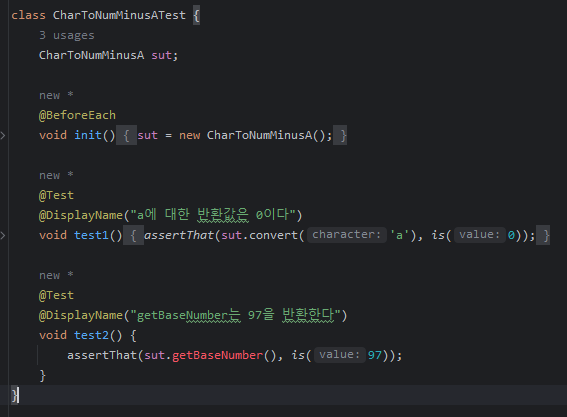
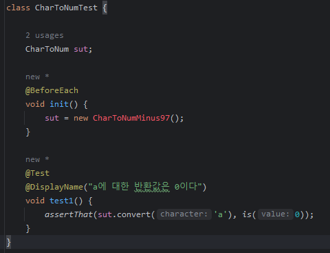
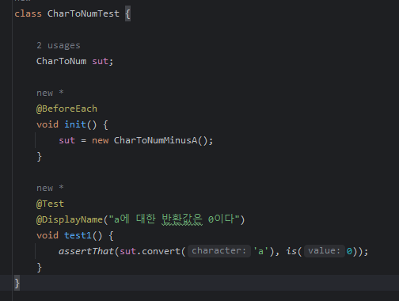

## 경계 테스트

* 아래와 같은 interface / implementation이 있다고 가정해 보겠습니다

```java
public interface CharToNum {
    int convert(char status);
}
```

```java
public class CharToNumMinus97 implements CharToNum {
    @Override
    public int convert(char character) {
        return character - getBaseNumber();
    }

    int getBaseNumber() {
        return 97;
    }
}
```

* char를 받으면 'a'의 십진수 값인 97을 빼서 int 값을 리턴하는 간단한 코드 입니다
* getBaseNumber는 기본이 될 a를 10진수로 변환한 97을 리턴합니다
* 따라서 convert 함수는 'a'=0, 'b'=1, 'c'=2.. 를 리턴하게 됩니다

* 그럼 여기에 test를 작성해보겠습니다

```java
class CharToNumMinus97Test {
    CharToNumMinus97 sut;

    @BeforeEach
    void init() {
        sut = new CharToNumMinus97();
    }

    @Test
    @DisplayName("a에 대한 반환값은 0이다")
    void test1() {
        assertThat(sut.convert('a'), is(0));
    }

    @Test
    @DisplayName("getBaseNumber는 97을 반환한다")
    void test2() {
        assertThat(sut.getBaseNumber(), is(97));
    }
}
```

* a를 받았을때 0을 return 하는지 확인하는 테스트와, baseNumber 함수가 97을 잘 반환하는지 확인하는 테스트를 작성했습니다
* 그런데 ascii 코드 값이 바뀔 수도 있기 때문에 a값 97을 상수로 쓰는것이 불안해졌습니다
  * 아마 실제로는 그럴일 없겠지만 전화번호가 몇십년만에 10자리에서 11자리가 된 것을 생각해보면 또 모르는 일이기도 합니다
* 이 문제를 해결하기 위해 기존 클래스를 대체하는 새로운 클래스를 만들게 되었습니다

```java
public class CharToNumMinusA implements CharToNum {

    @Override
    public int convert(char character) {
        return character - 'a';
    }
}
```
* 의도를 반영한 구현체가 잘 작성됐습니다

### 구현체를 변경했을 때의 문제
* 그런데 여기서 문제가 한가지 있습니다. 테스트가 꺠져버린 것이죠



* `CharToNumMinus97`이라는 클래스를 `CharToNumMinusA`로 대체했기 때문에 `CharToNumMinus97Test`는 새롭게 작성해야 합니다
* 명세는 바뀐것이 없기 때문에 test 역시 명세를 재활용할 수 있을 것이라 기대하고 재사용하여 새로운 test를 작성합니다



* 하지만 아쉽게도 `CharToNumMinusA`에는 `getBaseNumber` 함수가 존재하지 않기 때문에 test를 수정해야 합니다

```java
class CharToNumMinusATest {
    CharToNumMinusA sut;

    @BeforeEach
    void init() {
        sut = new CharToNumMinusA();
    }

    @Test
    @DisplayName("a에 대한 반환값은 0이다")
    void test1() {
        assertThat(sut.convert('a'), is(0));
    }
}
```
* `@DisplayName("getBaseNumber는 97을 반환한다")` 는 확인할 필요 없는 `CharToNumMinus97`의 세부사항 이었던 것이죠
* 그러면 어떻게 해야 했을까요?


### 경계를 테스트 해보자
* 이러한 문제를 해결하기 위한 것이 `경계를 테스트해야 한다` 입니다
* 경계(interface)를 테스트 해야하고, 내부 구현은 구현체에서만 알아야 하는 세부사항이라는 것이죠
```java
class CharToNumTest {

    CharToNum sut;

    @BeforeEach
    void init() {
        sut = new CharToNumMinus97();
    }

    @Test
    @DisplayName("a에 대한 반환값은 0이다")
    void test1() {
        assertThat(sut.convert('a'), is(0));
    }
}
```
* 제시한 방법에 따라 구현체인 `CharToNumMinus97` 대신 `CharToNum` interface에 대한 test를 작성했습니다
* 마찬가지로 `CharToNumMinus97`을 `CharToNumMinusA`로 대체해보겠습니다



* 여기도 테스트가 고장났네요



* 구현체의 주입만 변경해주자 test가 복원됩니다
* 명세 또한 변하지 않았습니다
* 우리가 대체한 것처럼 구현체를 변경해주기만 하면 test에는 변경이 없었습니다

### 그래서
* 우리가 여기서 알 수 있는것은 경계를 테스트하면 세부 구현에 따른 변경이 테스트에 영향을 적게 미친다는 것입니다
  * 그리고 우리가 무엇을 테스트해야 하는지도 명확해집니다
* 구현체의 변경(getBaseNumber)이 테스트 실패로 이어지지 않으며, 사실은 이 테스트를 작성하지도 않았을 것입니다
* 클래스가 변경되어도 테스트 클래스는 변하지 않습니다
* Spring과 같이 DI를 자동으로 지원하는 경우에는 더 간단해 집니다
  * Test에 아무런 변화없이 구현체의 주입을 자동으로 해주기 때문에 test 코드에 아무런 변화가 없습니다
> 따라서 test를 interface에 작성하는 것이 좋습니다
